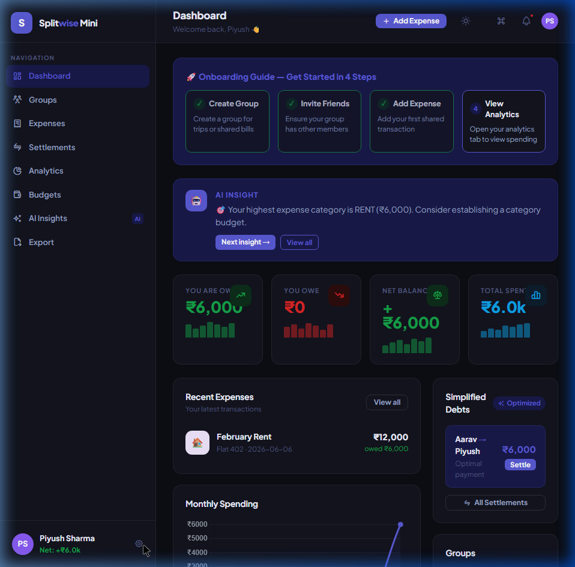

# 💸 SettleFlow

> A premium, high-performance multi-user expense sharing platform powered by a greedy debt-simplification engine.

[](https://github.com/piyushagr0905/SettleFlow/blob/main/LICENSE)
[](https://www.prisma.io/)
[](https://nodejs.org/)
[](https://expressjs.com/)

SettleFlow transforms group expense management by eliminating manual math. With dynamic multi-user support, custom splitting styles, and a custom greedy cash flow simplification routing algorithm, SettleFlow reduces transactional friction in shared households, trips, and shared bills.

---

## 📸 Interface Preview

Here is a look at the SettleFlow dashboard, featuring our modern glassmorphic theme, real-time balance stats, active first-time user onboarding wizard, and dynamic AI insights:



---

## 🚀 Key Highlights & Architectural Modules

### 🔒 1. Secure Authentication & User Isolation
- **JWT Middleware**: Endpoint protection via JSON Web Tokens (`authenticateToken`). Users can only query groups, expenses, and notifications where they are active members.
- **Credential Protection**: Account creation implements secure password hashing via `bcryptjs` (rounds = 10).
- **Personalized Space**: Upon registration, users receive distinct avatar colors and onboarding workflows unique to their database state.

### ⚡ 2. Greedy Debt-Routing Engine (Min-Cash-Flow)
SettleFlow replaces complex, messy pairwise debt loops with an optimal payment routing scheme. It aggregates all shared expenses and settlements inside a group, computes the net balance of every user, and executes a greedy match to connect the largest debtor with the largest creditor:
```javascript
// Mathematical matching logic
const amount = Math.min(maxCredit, maxDebit);
netBalances[maxCredit] -= amount;
netBalances[maxDebit] -= amount;
```
This reduces the maximum number of individual bank transactions from $O(N^2)$ to at most $N - 1$.

### 🎨 3. Focus-Safe Single-Page Application (SPA)
- **State-Driven Rendering**: The interface builds its DOM dynamically in a single container.
- **Blur-Free Input Restoration**: Solves standard SPA rendering bugs by caching document focus states, cursor positions, and selection ranges immediately prior to DOM swaps. This enables continuous typing on inputs (such as filter lists or command palettes) during asynchronous cycles.
- **Command Palette (Ctrl + K)**: Integrated global keyboard utility to quickly navigate tabs, add expenses, and query group ledgers.

### 📊 4. Smart Budgets & Real-Time Alerts
- **Budget Thresholds**: Warns all group members via instant notification triggers when spending crosses 80% and 100% of a group's monthly budget.
- **Notification Inbox**: Keeps users up to date on new bills split with them, welcome milestones, and settlements received.

---

## 🗄️ Database Schema & Models
The project implements a relational schema managed through Prisma:

- **User**: Stores profiles, secure hash credentials, and metadata.
- **Group & GroupMember**: Manages group contexts and memberships.
- **Expense & ExpenseSplit**: Tracks expense amounts, payment originators, split types (`equal`, `percentage`, `exact`, `shares`), and individual balances.
- **Settlement**: Logs payment transactions between members.
- **Notification**: Feeds the real-time inbox.

---

## 🛠️ Tech Stack & Dependencies

- **Frontend**: HTML5, Vanilla CSS (Variables, Flexbox, CSS Grid), Vanilla JS
- **Backend Server**: Node.js & Express.js
- **ORM**: Prisma Client v6.2.0
- **Database**: SQLite
- **Libraries**: `jsonwebtoken` (session handling), `bcryptjs` (hash algorithms)

---

## 💻 Getting Started

### Prerequisites
- Node.js (v18 or higher)
- npm

### Installation & Local Run

1. **Clone the Repo:**
   ```bash
   git clone https://github.com/piyushagr0905/SettleFlow.git
   cd SettleFlow
   ```

2. **Install Dependencies:**
   ```bash
   npm install
   ```

3. **Configure Environment Variables (`.env`):**
   Create a `.env` file in the root folder:
   ```env
   DATABASE_URL="file:./dev.db"
   JWT_SECRET="settleflow-super-secure-key"
   PORT=8000
   ```

4. **Initialize Database & Client:**
   ```bash
   npx prisma migrate dev --name init
   npx prisma generate
   ```

5. **Start Development Server:**
   ```bash
   npm run dev
   ```
   Open `http://localhost:8000` in your web browser.

---

## 📜 License
Distributed under the MIT License. See `LICENSE` for details.
